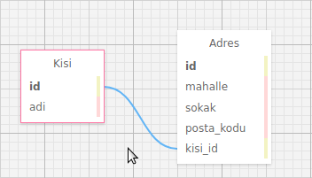

SQLAlchemy
==========

Kaynak: https://www.pythoncentral.io/introductory-tutorial-python-sqlalchemy/

SQLAlchemy ve Object-Relational Mapping
---------------------------------------

Uygulama geliştirirken her seferinde veritabanı ile ilgili birşeyler yaparız.
Çoğunlukla SQL cümleleri oluşturup veritabanı bağlantısına verir, gelen cevabı alıp kullanırız. Bu, uzun zamandan beri kullanılan geleneksel yöntemdir.

Geleneksel yöntemin yanında, yazılımcılar Object-Relational Mapping (ORM) yöntemini kullanarak esnek olmayan ve bakımı zor düz SQL cümleleri kullanmadan veritabanı uygulamaları yazabilmektedirler.

Önce eski yöntemle basit bir örnek yazalım. Ardından aynı örneği ORM ile yazacağız.

Eski Yöntemle Veritabanı Uygulaması
-----------------------------------

Sqlite3 kullanarak kişi ve adres tabloları oluşturup, bu tablolara veri gireceğiz. Kişi ve adres adlı iki tablomuz var. Bir kişiye ait birden fazla adres kaydı olabilir.

adres.kisi_id, kişi tablosuna foreign_key ile bağlıdır.

   Veritabanı şeması
	   

.. literalinclude:: sqlite_ex.py
   :language: python

Her tabloya birer kayıt ekliyoruz. Aşağıdaki komutu çalıştırarak veritabanını oluştururuz.

.. code-block:: bash
		
   $ python3 sqlite_ex.py

Şimdi bu veritabanını sorgulayan uygulamayı yazalım:

.. literalinclude:: sqlite_q.py
   :language: python

Şimdi bu kodu çalıştıralım:

.. code-block:: bash
		
   $ python3 sqlite_q.py
   [(1, 'Ilker Manap')]
   [(1, 'Stokholm', '1', '00000', 1)]

Yukarıdaki örnekte, sqlite3 veritabanını oluşturmak ve kayıt girmek için SQL
cümleleri kullandık. Bu cümlelerle işimizi yapabilmiş olsak bile, uygulamanın
bu halinin bakımı oldukça zordur.

Aşağıda, üstte gerçekleştirilen işlemlerin SQLAlchemy ile nasıl yapılacağını
göreceğiz.

SQLAlchemy ve Declarative
-------------------------

SQLAlchemy ile program yazarken dikkat etmemiz gereken üç önemli kısım vardır:

* Bir Table, veritabanındaki tabloya karşılık gelir.
* Mapper, bir python sınıfını veritabanındaki bir tabloya eşleştirir.
* Bir veritabanı kaydının normal bir python nesnesine eşleştiren sınıf.

Yukarıda belirtilen Table, mapper ve python sınıfı için farklı yerlerde
kod yazmak yerine, SQLAlchemy içindeki declarative tanımını kullanacağız.
Bu tanım ile yukarıdaki üç farklı tanımı tek sınıf içinde yazabiliriz.

.. literalinclude:: sqlite_sqlalchemy_ex.py
   :language: python

Yukarıdaki kodu sqlite_sqlalchemy_ex.py adıyla kaydedip çalıştıralım:

.. code-block:: bash

   $ python3 sqlite_sqlalchemy_ex.py

Bu işlem sonucunda içinde boş tabloları olan sqlalchemy_ornek.db veritabanı
yaratılmış olur. Şimdi, bu tabloya kayıt ekleyelim:

.. literalinclude:: sqlite_sqlalchemy_q.py
   :language: python
		 

   

